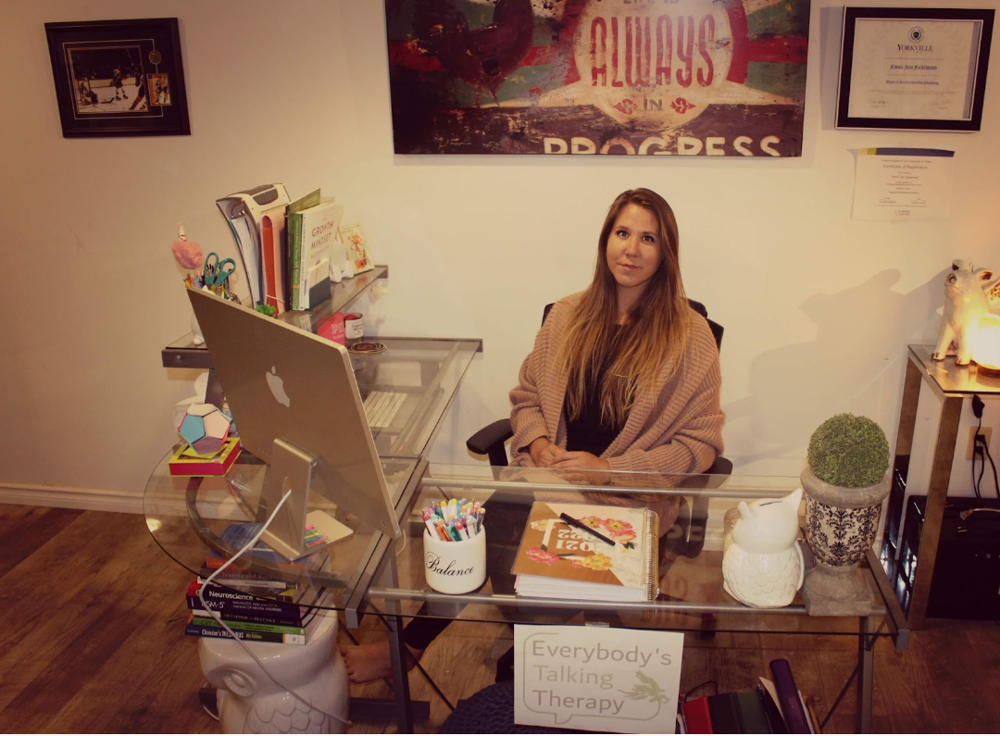

I have worked in the mental health field for the last eight years and throughout many diversities/personal experiences my career development has allowed me to develop into the practitioner I am today. I stay true to my genuine and unconditionally supportive values, which  center around: 
 - automonmy 
 - authenticity 
 - growth 
 - passion 
 - empathy

I hold a safe space for those who are ready to understand and explore tthemselves

## Treatment Focus
- Addiction
- Anxiety/Panic
- Brain Injuries/Stroke
- Complex/Acute Trauma
- Chronic Pain
- Depression
- Developmental Disorders
- Grief and Loss
- Mood Disturbances
- Personality Disorders
- Relationship Difficulties

## Therapy Styles
- Acceptance and Commitment Therapy (ACT)
- Cognitive Behavioural Therapy (CBT)
- Dialectical Behavioural Therapy (DBT)
- Emotionally Focused Therapy (EFT)
- Internal Family Systems (IFS)
- Neuropsychology
- Narrative
- Person-Centered 
- Solution Focused

